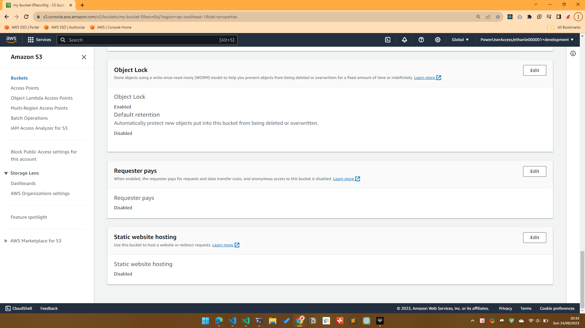
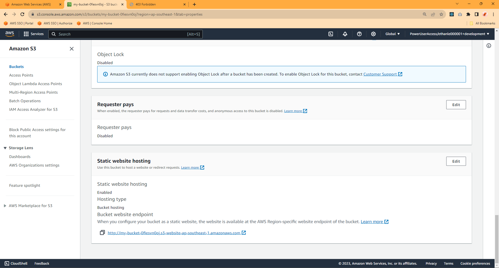
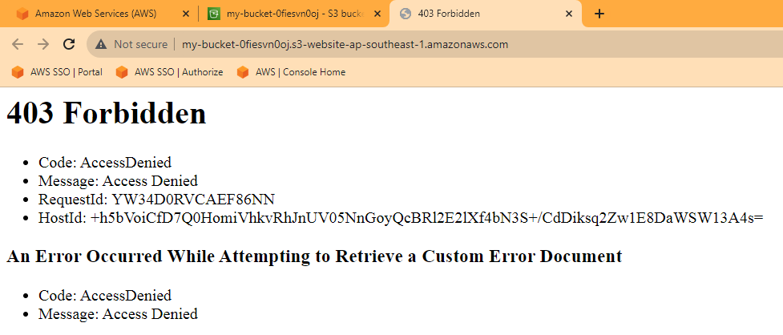
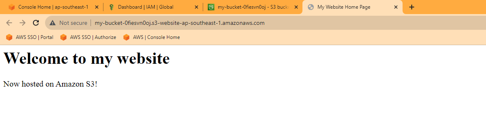
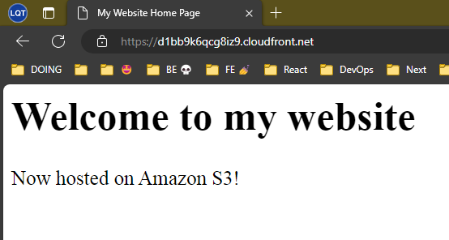

# Frontend challenge - Terraform

## S3

### Hello Bucket

- Create the Terraform configuration

  ```t
  # 01-hello-bucket/main.tf
  provider "aws" {
    region = "ap-southeast-1"
  }

  resource "aws_s3_bucket" "main" {
    bucket = "my-bucket-0fiesvn0oj"
  }
  ```

- Run `terraform init`

  ```shell
  $ terraform init

  Initializing the backend...

  Initializing provider plugins...
  - Finding latest version of hashicorp/aws...
  - Installing hashicorp/aws v5.17.0...
  - Installed hashicorp/aws v5.17.0 (signed by HashiCorp)

  Terraform has created a lock file .terraform.lock.hcl to record the provider
  selections it made above. Include this file in your version control repository
  so that Terraform can guarantee to make the same selections by default when
  you run "terraform init" in the future.

  Terraform has been successfully initialized!

  You may now begin working with Terraform. Try running "terraform plan" to see
  any changes that are required for your infrastructure. All Terraform commands
  should now work.

  If you ever set or change modules or backend configuration for Terraform,
  rerun this command to reinitialize your working directory. If you forget, other
  commands will detect it and remind you to do so if necessary.
  ```

- Run `terraform plan`

  ```shell
  $ terraform plan

  Terraform used the selected providers to generate the following execution plan. Resource actions are indicated with the following symbols:
    + create

  Terraform will perform the following actions:

    # aws_s3_bucket.main will be created
    + resource "aws_s3_bucket" "main" {
        + acceleration_status         = (known after apply)
        + acl                         = (known after apply)
        + arn                         = (known after apply)
        + bucket                      = "my-bucket-0fiesvn0oj"
        + bucket_domain_name          = (known after apply)
        + bucket_prefix               = (known after apply)
        + bucket_regional_domain_name = (known after apply)
        + force_destroy               = false
        + hosted_zone_id              = (known after apply)
        + id                          = (known after apply)
        + object_lock_enabled         = (known after apply)
        + policy                      = (known after apply)
        + region                      = (known after apply)
        + request_payer               = (known after apply)
        + tags_all                    = (known after apply)
        + website_domain              = (known after apply)
        + website_endpoint            = (known after apply)
      }

  Plan: 1 to add, 0 to change, 0 to destroy.

  ─────────────────────────────────────────────────────────────────────────────────────────────────────────────────────────────────────────────────────────────────

  Note: You didn't use the -out option to save this plan, so Terraform can't guarantee to take exactly these actions if you run "terraform apply" now.
  ```

- Run `terraform apply`:

  ```shell
  $ terraform apply

  Terraform used the selected providers to generate the following execution plan. Resource actions are indicated with the
  following symbols:
    + create

  Terraform will perform the following actions:

    # aws_s3_bucket.main will be created
    + resource "aws_s3_bucket" "main" {
        + acceleration_status         = (known after apply)
        + acl                         = (known after apply)
        + arn                         = (known after apply)
        + bucket                      = "my-bucket-0fiesvn0oj"
        + bucket_domain_name          = (known after apply)
        + bucket_prefix               = (known after apply)
        + bucket_regional_domain_name = (known after apply)
        + force_destroy               = false
        + hosted_zone_id              = (known after apply)
        + id                          = (known after apply)
        + object_lock_enabled         = (known after apply)
        + policy                      = (known after apply)
        + region                      = (known after apply)
        + request_payer               = (known after apply)
        + tags_all                    = (known after apply)
        + website_domain              = (known after apply)
        + website_endpoint            = (known after apply)
      }

  Plan: 1 to add, 0 to change, 0 to destroy.

  Do you want to perform these actions?
    Terraform will perform the actions described above.
    Only 'yes' will be accepted to approve.

    Enter a value:
  ```

- Type `yes` then press `Enter`:

  ```shell
  Do you want to perform these actions?
    Terraform will perform the actions described above.
    Only 'yes' will be accepted to approve.

    Enter a value: yes

  aws_s3_bucket.main: Creating...
  ╷
  │ Error: creating Amazon S3 (Simple Storage) Bucket (my-bucket-0fiesvn0oj): AccessDenied: Access Denied
  │       status code: 403, request id: RWGJ8HFN2A8YQRKS, host id: ZWgmzniF+oR3deePvmAVWJ6dbIj1j4VXwArjCX16dCt1ep4PmXvWu0MMkqgNuDWWY/908nF/gE4=
  │
  │   with aws_s3_bucket.main,
  │   on main.tf line 5, in resource "aws_s3_bucket" "main":
  │    5: resource "aws_s3_bucket" "main" {
  ```

  👉 Terraform hasn't have the credential yet.

  > ℹ️ NOTE
  >
  > `terraform apply` will call APIs to AWS to create the S3 bucket. Terraform will use the authenticate mechanism of AWS ClI.

- Let's configure the AWS CLI so it has the credential to call APIs

  - Login in the CLI

    ```shell
    $ aws-sso-util login --profile ethan-dev
    Logging in https://ethanle.awsapps.com/start
    Login with IAM Identity Center required.
    Attempting to open the authorization page in your default browser.
    If the browser does not open or you wish to use a different device to
    authorize this request, open the following URL:

    https://device.sso.ap-southeast-1.amazonaws.com/

    Then enter the code:

    ZFNC-NPNV
    ```

  - Authorize the SSO login attempt by open the link, enter the code, and approve.

  - Back to the Terminal, the login is succeeded.

    ```shell
    Login succeeded, valid until 2023-09-25 03:22 +07
    ```

  - Asume the role

    ```shell
    $ awsume ethan-dev
    [ethan-dev] Role credentials will expire 2023-09-25 00:22:16
    ```

- Let's re-run `terraform apply`:

  ```shell
  $ terraform apply

  Terraform used the selected providers to generate the following execution plan. Resource actions are indicated with the
  following symbols:
    + create

  Terraform will perform the following actions:

    # aws_s3_bucket.main will be created
    + resource "aws_s3_bucket" "main" {
        + acceleration_status         = (known after apply)
        + acl                         = (known after apply)
        + arn                         = (known after apply)
        + bucket                      = "my-bucket-0fiesvn0oj"
        + bucket_domain_name          = (known after apply)
        + bucket_prefix               = (known after apply)
        + bucket_regional_domain_name = (known after apply)
        + force_destroy               = false
        + hosted_zone_id              = (known after apply)
        + id                          = (known after apply)
        + object_lock_enabled         = (known after apply)
        + policy                      = (known after apply)
        + region                      = (known after apply)
        + request_payer               = (known after apply)
        + tags_all                    = (known after apply)
        + website_domain              = (known after apply)
        + website_endpoint            = (known after apply)
      }

  Plan: 1 to add, 0 to change, 0 to destroy.

  Do you want to perform these actions?
    Terraform will perform the actions described above.
    Only 'yes' will be accepted to approve.

    Enter a value: yes

  aws_s3_bucket.main: Creating...
  aws_s3_bucket.main: Creation complete after 3s [id=my-bucket-0fiesvn0oj]

  Apply complete! Resources: 1 added, 0 changed, 0 destroyed.
  ```

- Run `terraform destroy`:

  ```shell
  $ terraform destroy
  aws_s3_bucket.main: Refreshing state... [id=my-bucket-0fiesvn0oj]

  Terraform used the selected providers to generate the following execution plan. Resource actions are indicated with the
  following symbols:
    - destroy

  Terraform will perform the following actions:

    # aws_s3_bucket.main will be destroyed
    - resource "aws_s3_bucket" "main" {
        - arn                         = "arn:aws:s3:::my-bucket-0fiesvn0oj" -> null
        - bucket                      = "my-bucket-0fiesvn0oj" -> null
        - bucket_domain_name          = "my-bucket-0fiesvn0oj.s3.amazonaws.com" -> null
        - bucket_regional_domain_name = "my-bucket-0fiesvn0oj.s3.ap-southeast-1.amazonaws.com" -> null
        - force_destroy               = false -> null
        - hosted_zone_id              = "Z3O0J2DXBE1FTB" -> null
        - id                          = "my-bucket-0fiesvn0oj" -> null
        - object_lock_enabled         = false -> null
        - region                      = "ap-southeast-1" -> null
        - request_payer               = "BucketOwner" -> null
        - tags                        = {} -> null
        - tags_all                    = {} -> null

        - grant {
            - id          = "33c05eaa9c1c48633d94df2e894c86d5e41521ad15a10f7ecea445386947f2e2" -> null
            - permissions = [
                - "FULL_CONTROL",
              ] -> null
            - type        = "CanonicalUser" -> null
          }

        - server_side_encryption_configuration {
            - rule {
                - bucket_key_enabled = false -> null

                - apply_server_side_encryption_by_default {
                    - sse_algorithm = "AES256" -> null
                  }
              }
          }

        - versioning {
            - enabled    = false -> null
            - mfa_delete = false -> null
          }
      }

  Plan: 0 to add, 0 to change, 1 to destroy.

  Do you really want to destroy all resources?
    Terraform will destroy all your managed infrastructure, as shown above.
    There is no undo. Only 'yes' will be accepted to confirm.

    Enter a value:
  ```

  ```shell
    Enter a value: yes

  aws_s3_bucket.main: Destroying... [id=my-bucket-0fiesvn0oj]
  aws_s3_bucket.main: Destruction complete after 2s
  ```

### Bucket with custom properties

- In the Terraform configuration, add some properties for the bucket

```t
# 02-hello-bucket-resource-properties/main.tf
provider "aws" {
  region = "ap-southeast-1"
}

resource "aws_s3_bucket" "main" {
  bucket              = "my-bucket-0fiesvn0oj"
  object_lock_enabled = true
}
```

- Run `terraform init`:

  ```shell
  $ terraform init

  Initializing the backend...

  Initializing provider plugins...
  - Reusing previous version of hashicorp/aws from the dependency lock file
  - Using previously-installed hashicorp/aws v5.17.0

  Terraform has been successfully initialized!

  You may now begin working with Terraform. Try running "terraform plan" to see
  any changes that are required for your infrastructure. All Terraform commands
  should now work.

  If you ever set or change modules or backend configuration for Terraform,
  rerun this command to reinitialize your working directory. If you forget, other
  commands will detect it and remind you to do so if necessary.
  ```

- Run `terraform plan`:

  ```t
  $ terraform plan

  Terraform used the selected providers to generate the following execution plan. Resource actions are indicated with the
  following symbols:
    + create

  Terraform will perform the following actions:

    # aws_s3_bucket.main will be created
    + resource "aws_s3_bucket" "main" {
        + acceleration_status         = (known after apply)
        + acl                         = (known after apply)
        + arn                         = (known after apply)
        + bucket                      = "my-bucket-0fiesvn0oj"
        + bucket_domain_name          = (known after apply)
        + bucket_prefix               = (known after apply)
        + bucket_regional_domain_name = (known after apply)
        + force_destroy               = false
        + hosted_zone_id              = (known after apply)
        + id                          = (known after apply)
        + object_lock_enabled         = true
        + policy                      = (known after apply)
        + region                      = (known after apply)
        + request_payer               = (known after apply)
        + tags_all                    = (known after apply)
        + website_domain              = (known after apply)
        + website_endpoint            = (known after apply)
      }

  Plan: 1 to add, 0 to change, 0 to destroy.

  ───────────────────────────────────────────────────────────────────────────────────────────────────────────────────────

  Note: You didn't use the -out option to save this plan, so Terraform can't guarantee to take exactly these actions if
  you run "terraform apply" now.
  ```

- Run `terraform apply`:

  ```t
  $ terraform apply

  Terraform used the selected providers to generate the following execution plan. Resource actions are indicated with the
  following symbols:
    + create

  Terraform will perform the following actions:

    # aws_s3_bucket.main will be created
    + resource "aws_s3_bucket" "main" {
        + acceleration_status         = (known after apply)
        + acl                         = (known after apply)
        + arn                         = (known after apply)
        + bucket                      = "my-bucket-0fiesvn0oj"
        + bucket_domain_name          = (known after apply)
        + bucket_prefix               = (known after apply)
        + bucket_regional_domain_name = (known after apply)
        + force_destroy               = false
        + hosted_zone_id              = (known after apply)
        + id                          = (known after apply)
        + object_lock_enabled         = true
        + policy                      = (known after apply)
        + region                      = (known after apply)
        + request_payer               = (known after apply)
        + tags_all                    = (known after apply)
        + website_domain              = (known after apply)
        + website_endpoint            = (known after apply)
      }

  Plan: 1 to add, 0 to change, 0 to destroy.

  Do you want to perform these actions?
    Terraform will perform the actions described above.
    Only 'yes' will be accepted to approve.

    Enter a value:
  ```

  ```shell
    Enter a value: yes

  aws_s3_bucket.main: Creating...
  aws_s3_bucket.main: Creation complete after 2s [id=my-bucket-0fiesvn0oj]
  ```

- (Optional) Check on the Web Console

  

- Run `terraform destroy`:

  ```t
  $ terraform destroy
  aws_s3_bucket.main: Refreshing state... [id=my-bucket-0fiesvn0oj]

  Terraform used the selected providers to generate the following execution plan. Resource actions are indicated with the
  following symbols:
    - destroy

  Terraform will perform the following actions:

    # aws_s3_bucket.main will be destroyed
    - resource "aws_s3_bucket" "main" {
        - arn                         = "arn:aws:s3:::my-bucket-0fiesvn0oj" -> null
        - bucket                      = "my-bucket-0fiesvn0oj" -> null
        - bucket_domain_name          = "my-bucket-0fiesvn0oj.s3.amazonaws.com" -> null
        - bucket_regional_domain_name = "my-bucket-0fiesvn0oj.s3.ap-southeast-1.amazonaws.com" -> null
        - force_destroy               = false -> null
        - hosted_zone_id              = "Z3O0J2DXBE1FTB" -> null
        - id                          = "my-bucket-0fiesvn0oj" -> null
        - object_lock_enabled         = true -> null
        - region                      = "ap-southeast-1" -> null
        - request_payer               = "BucketOwner" -> null
        - tags                        = {} -> null
        - tags_all                    = {} -> null

        - grant {
            - id          = "33c05eaa9c1c48633d94df2e894c86d5e41521ad15a10f7ecea445386947f2e2" -> null
            - permissions = [
                - "FULL_CONTROL",
              ] -> null
            - type        = "CanonicalUser" -> null
          }

        - object_lock_configuration {
            - object_lock_enabled = "Enabled" -> null
          }

        - server_side_encryption_configuration {
            - rule {
                - bucket_key_enabled = false -> null

                - apply_server_side_encryption_by_default {
                    - sse_algorithm = "AES256" -> null
                  }
              }
          }

        - versioning {
            - enabled    = true -> null
            - mfa_delete = false -> null
          }
      }

  Plan: 0 to add, 0 to change, 1 to destroy.

  Do you really want to destroy all resources?
    Terraform will destroy all your managed infrastructure, as shown above.
    There is no undo. Only 'yes' will be accepted to confirm.

    Enter a value:
  ```

  ```shell
    Enter a value: yes

  aws_s3_bucket.main: Destroying... [id=my-bucket-0fiesvn0oj]
  aws_s3_bucket.main: Destruction complete after 2s
  ```

### Bucket for hosting public website

- Terraform configuration:

  ```t
  provider "aws" {
    region = "ap-southeast-1"
  }

  resource "aws_s3_bucket" "main" {
    bucket = "my-bucket-0fiesvn0oj"
  }

  resource "aws_s3_bucket_website_configuration" "main" {
    bucket = aws_s3_bucket.main.id

    index_document {
      suffix = "index.html"
    }

    error_document {
      key = "error.html"
    }
  }
  ```

- Run `terraform init`:

  ```shell
  $ terraform init

  Initializing the backend...

  Initializing provider plugins...
  - Reusing previous version of hashicorp/aws from the dependency lock file
  - Using previously-installed hashicorp/aws v5.17.0

  Terraform has been successfully initialized!
  ```

- Run `terraform plan`:

  ```shell
  $ terraform plan

  Terraform used the selected providers to generate the following execution plan. Resource actions are indicated with the
  following symbols:
    + create

  Terraform will perform the following actions:

    # aws_s3_bucket.main will be created
    + resource "aws_s3_bucket" "main" {
        + acceleration_status         = (known after apply)
        + acl                         = (known after apply)
        + arn                         = (known after apply)
        + bucket                      = "my-bucket-0fiesvn0oj"
        + bucket_domain_name          = (known after apply)
        + bucket_prefix               = (known after apply)
        + bucket_regional_domain_name = (known after apply)
        + force_destroy               = false
        + hosted_zone_id              = (known after apply)
        + id                          = (known after apply)
        + object_lock_enabled         = (known after apply)
        + policy                      = (known after apply)
        + region                      = (known after apply)
        + request_payer               = (known after apply)
        + tags_all                    = (known after apply)
        + website_domain              = (known after apply)
        + website_endpoint            = (known after apply)
      }

    # aws_s3_bucket_website_configuration.main will be created
    + resource "aws_s3_bucket_website_configuration" "main" {
        + bucket           = (known after apply)
        + id               = (known after apply)
        + routing_rules    = (known after apply)
        + website_domain   = (known after apply)
        + website_endpoint = (known after apply)

        + error_document {
            + key = "error.html"
          }

        + index_document {
            + suffix = "index.html"
          }
      }

  Plan: 2 to add, 0 to change, 0 to destroy.

  ───────────────────────────────────────────────────────────────────────────────────────────────────────────────────────

  Note: You didn't use the -out option to save this plan, so Terraform can't guarantee to take exactly these actions if
  you run "terraform apply" now.
  ```

- Run `terraform apply`:

  ```shell
  $ terraform apply

  Terraform used the selected providers to generate the following execution plan. Resource actions are indicated with the
  following symbols:
    + create

  Terraform will perform the following actions:

    # aws_s3_bucket.main will be created
    + resource "aws_s3_bucket" "main" {
        + acceleration_status         = (known after apply)
        + acl                         = (known after apply)
        + arn                         = (known after apply)
        + bucket                      = "my-bucket-0fiesvn0oj"
        + bucket_domain_name          = (known after apply)
        + bucket_prefix               = (known after apply)
        + bucket_regional_domain_name = (known after apply)
        + force_destroy               = false
        + hosted_zone_id              = (known after apply)
        + id                          = (known after apply)
        + object_lock_enabled         = (known after apply)
        + policy                      = (known after apply)
        + region                      = (known after apply)
        + request_payer               = (known after apply)
        + tags_all                    = (known after apply)
        + website_domain              = (known after apply)
        + website_endpoint            = (known after apply)
      }

    # aws_s3_bucket_website_configuration.main will be created
    + resource "aws_s3_bucket_website_configuration" "main" {
        + bucket           = (known after apply)
        + id               = (known after apply)
        + routing_rules    = (known after apply)
        + website_domain   = (known after apply)
        + website_endpoint = (known after apply)

        + error_document {
            + key = "error.html"
          }

        + index_document {
            + suffix = "index.html"
          }
      }

  Plan: 2 to add, 0 to change, 0 to destroy.

  Do you want to perform these actions?
    Terraform will perform the actions described above.
    Only 'yes' will be accepted to approve.

    Enter a value: yes

  aws_s3_bucket.main: Creating...
  aws_s3_bucket.main: Creation complete after 2s [id=my-bucket-0fiesvn0oj]
  aws_s3_bucket_website_configuration.main: Creating...
  aws_s3_bucket_website_configuration.main: Still creating... [10s elapsed]
  aws_s3_bucket_website_configuration.main: Creation complete after 11s [id=my-bucket-0fiesvn0oj]

  Apply complete! Resources: 2 added, 0 changed, 0 destroyed.
  ```

- Update the website (the `index.html`, and `error.html`)

  ```shell
  $ aws s3 sync . s3://my-bucket-0fiesvn0oj
  upload: ./index.html to s3://my-bucket-0fiesvn0oj/index.html
  upload: ./error.html to s3://my-bucket-0fiesvn0oj/error.html
  ```

- Let's go to our website, but we don't know where is it 😢.

  - We can go to the Web Console to get the website address.

    

  - Let's go to our website

    

    > Why 403 Forbidden?
    >
    > Starting in April 2023, Amazon S3 will introduce two new default bucket security settings by automatically enabling `S3 Block Public Access` and disabling S3 access control lists (ACLs) for all new S3 buckets.
    >
    > We need to disable all the S3 Block Public Access.

  - Update the Terraform configuration:

    ```t
    resource "aws_s3_bucket_public_access_block" "main" {
      bucket = aws_s3_bucket.main.id

      block_public_acls       = false
      block_public_policy     = false
      ignore_public_acls      = false
      restrict_public_buckets = false
    }
    ```

  - Re-run `terraform plan` and `terraform apply`:

    ```shell
    $ terraform plan
    aws_s3_bucket.main: Refreshing state... [id=my-bucket-0fiesvn0oj]
    aws_s3_bucket_website_configuration.main: Refreshing state... [id=my-bucket-0fiesvn0oj]

    Terraform used the selected providers to generate the following execution plan. Resource actions are indicated with the
    following symbols:
      + create

    Terraform will perform the following actions:

      # aws_s3_bucket_public_access_block.main will be created
      + resource "aws_s3_bucket_public_access_block" "main" {
          + block_public_acls       = false
          + block_public_policy     = false
          + bucket                  = "my-bucket-0fiesvn0oj"
          + id                      = (known after apply)
          + ignore_public_acls      = false
          + restrict_public_buckets = false
        }

    Plan: 1 to add, 0 to change, 0 to destroy.

    Do you want to perform these actions?
      Terraform will perform the actions described above.
      Only 'yes' will be accepted to approve.

      Enter a value:
    ```

    ```shell
    $ terraform apply
    # ...

    Plan: 1 to add, 0 to change, 0 to destroy.

    Do you want to perform these actions?
      Terraform will perform the actions described above.
      Only 'yes' will be accepted to approve.

      Enter a value:
    ```

    ```shell
    $ terraform apply
      Enter a value: yes

    aws_s3_bucket_public_access_block.main: Creating...
    aws_s3_bucket_public_access_block.main: Creation complete after 0s [id=my-bucket-0fiesvn0oj]

    Apply complete! Resources: 1 added, 0 changed, 0 destroyed.
    ```

  - Check our website again. It's still `403 Forbidden`. Why 😭?

  - We need to explicitly allow the objects in the bucket be accessed by everyone:

    ```t
    resource "aws_s3_bucket_policy" "main" {
      bucket = aws_s3_bucket.site.id

      policy = jsonencode({
        Version = "2012-10-17"
        Statement = [
          {
            Sid       = "PublicReadGetObject"
            Effect    = "Allow"
            Principal = "*"
            Action    = "s3:GetObject"
            Resource = [
              aws_s3_bucket.site.arn,
              "${aws_s3_bucket.site.arn}/*",
            ]
          },
        ]
      })
    }
    ```

    ```shell
    $ terraform apply
    aws_s3_bucket.main: Refreshing state... [id=my-bucket-0fiesvn0oj]
    aws_s3_bucket_public_access_block.main: Refreshing state... [id=my-bucket-0fiesvn0oj]
    aws_s3_bucket_website_configuration.main: Refreshing state... [id=my-bucket-0fiesvn0oj]

    Terraform used the selected providers to generate the following execution plan. Resource actions are indicated with the
    following symbols:
      + create

    Terraform will perform the following actions:

      # aws_s3_bucket_policy.site will be created
      + resource "aws_s3_bucket_policy" "site" {
          + bucket = "my-bucket-0fiesvn0oj"
          + id     = (known after apply)
          + policy = jsonencode(
                {
                  + Statement = [
                      + {
                          + Action    = "s3:GetObject"
                          + Effect    = "Allow"
                          + Principal = "*"
                          + Resource  = [
                              + "arn:aws:s3:::my-bucket-0fiesvn0oj",
                              + "arn:aws:s3:::my-bucket-0fiesvn0oj/*",
                            ]
                          + Sid       = "PublicReadGetObject"
                        },
                    ]
                  + Version   = "2012-10-17"
                }
            )
        }

    Plan: 1 to add, 0 to change, 0 to destroy.

    Do you want to perform these actions?
      Terraform will perform the actions described above.
      Only 'yes' will be accepted to approve.

      Enter a value: yes

    aws_s3_bucket_policy.site: Creating...
    aws_s3_bucket_policy.site: Creation complete after 1s [id=my-bucket-0fiesvn0oj]

    Apply complete! Resources: 1 added, 0 changed, 0 destroyed.
    ```

  - Now our website is live

    

- Run `terraform destroy`:

  ```shell
  $  terraform destroy
  aws_s3_bucket.main: Refreshing state... [id=my-bucket-0fiesvn0oj]
  aws_s3_bucket_public_access_block.main: Refreshing state... [id=my-bucket-0fiesvn0oj]
  aws_s3_bucket_policy.site: Refreshing state... [id=my-bucket-0fiesvn0oj]
  aws_s3_bucket_website_configuration.main: Refreshing state... [id=my-bucket-0fiesvn0oj]

  Terraform used the selected providers to generate the following execution plan. Resource actions are indicated with the
  following symbols:
    - destroy

  Terraform will perform the following actions:

    # aws_s3_bucket.main will be destroyed
    - resource "aws_s3_bucket" "main" {
        - arn                         = "arn:aws:s3:::my-bucket-0fiesvn0oj" -> null
        - bucket                      = "my-bucket-0fiesvn0oj" -> null
        - bucket_domain_name          = "my-bucket-0fiesvn0oj.s3.amazonaws.com" -> null
        - bucket_regional_domain_name = "my-bucket-0fiesvn0oj.s3.ap-southeast-1.amazonaws.com" -> null
        - force_destroy               = false -> null
        - hosted_zone_id              = "Z3O0J2DXBE1FTB" -> null
        - id                          = "my-bucket-0fiesvn0oj" -> null
        - object_lock_enabled         = false -> null
        - policy                      = jsonencode(
              {
                - Statement = [
                    - {
                        - Action    = "s3:GetObject"
                        - Effect    = "Allow"
                        - Principal = "*"
                        - Resource  = [
                            - "arn:aws:s3:::my-bucket-0fiesvn0oj",
                            - "arn:aws:s3:::my-bucket-0fiesvn0oj/*",
                          ]
                        - Sid       = "PublicReadGetObject"
                      },
                  ]
                - Version   = "2012-10-17"
              }
          ) -> null
        - region                      = "ap-southeast-1" -> null
        - request_payer               = "BucketOwner" -> null
        - tags                        = {} -> null
        - tags_all                    = {} -> null
        - website_domain              = "s3-website-ap-southeast-1.amazonaws.com" -> null
        - website_endpoint            = "my-bucket-0fiesvn0oj.s3-website-ap-southeast-1.amazonaws.com" -> null

        - grant {
            - id          = "33c05eaa9c1c48633d94df2e894c86d5e41521ad15a10f7ecea445386947f2e2" -> null
            - permissions = [
                - "FULL_CONTROL",
              ] -> null
            - type        = "CanonicalUser" -> null
          }

        - server_side_encryption_configuration {
            - rule {
                - bucket_key_enabled = false -> null

                - apply_server_side_encryption_by_default {
                    - sse_algorithm = "AES256" -> null
                  }
              }
          }

        - versioning {
            - enabled    = false -> null
            - mfa_delete = false -> null
          }

        - website {
            - error_document = "error.html" -> null
            - index_document = "index.html" -> null
          }
      }

    # aws_s3_bucket_policy.site will be destroyed
    - resource "aws_s3_bucket_policy" "site" {
        - bucket = "my-bucket-0fiesvn0oj" -> null
        - id     = "my-bucket-0fiesvn0oj" -> null
        - policy = jsonencode(
              {
                - Statement = [
                    - {
                        - Action    = "s3:GetObject"
                        - Effect    = "Allow"
                        - Principal = "*"
                        - Resource  = [
                            - "arn:aws:s3:::my-bucket-0fiesvn0oj",
                            - "arn:aws:s3:::my-bucket-0fiesvn0oj/*",
                          ]
                        - Sid       = "PublicReadGetObject"
                      },
                  ]
                - Version   = "2012-10-17"
              }
          ) -> null
      }

    # aws_s3_bucket_public_access_block.main will be destroyed
    - resource "aws_s3_bucket_public_access_block" "main" {
        - block_public_acls       = false -> null
        - block_public_policy     = false -> null
        - bucket                  = "my-bucket-0fiesvn0oj" -> null
        - id                      = "my-bucket-0fiesvn0oj" -> null
        - ignore_public_acls      = false -> null
        - restrict_public_buckets = false -> null
      }

    # aws_s3_bucket_website_configuration.main will be destroyed
    - resource "aws_s3_bucket_website_configuration" "main" {
        - bucket           = "my-bucket-0fiesvn0oj" -> null
        - id               = "my-bucket-0fiesvn0oj" -> null
        - website_domain   = "s3-website-ap-southeast-1.amazonaws.com" -> null
        - website_endpoint = "my-bucket-0fiesvn0oj.s3-website-ap-southeast-1.amazonaws.com" -> null

        - error_document {
            - key = "error.html" -> null
          }

        - index_document {
            - suffix = "index.html" -> null
          }
      }

  Plan: 0 to add, 0 to change, 4 to destroy.

  Do you really want to destroy all resources?
    Terraform will destroy all your managed infrastructure, as shown above.
    There is no undo. Only 'yes' will be accepted to confirm.

    Enter a value:
  ```

  ```shell
    Enter a value: yes

    aws_s3_bucket_policy.site: Destroying... [id=my-bucket-0fiesvn0oj]
    aws_s3_bucket_public_access_block.main: Destroying... [id=my-bucket-0fiesvn0oj]
    aws_s3_bucket_website_configuration.main: Destroying... [id=my-bucket-0fiesvn0oj]
    aws_s3_bucket_website_configuration.main: Destruction complete after 0s
    aws_s3_bucket_public_access_block.main: Destruction complete after 1s
    ╷
    │ Error: deleting S3 Bucket (my-bucket-0fiesvn0oj) Policy: operation error S3: DeleteBucketPolicy, https response error StatusCode: 409, RequestID: SPE1WNQCAFMKK2M5, HostID: WS7m0fNOO9dOVQEfmyYifRWGoTHkwtntV81VmBEpcAzaY2qStXJBUYvYrKRsm4dnBroMu/8/i23ivTRbmlE6Ng==, api error OperationAborted: A conflicting conditional operation is currently in progress against this resource. Please try again.
  ```

- Something's wrong. We can't delete the S3 bucket.

- Let's try again

  ```shell
  $  terraform destroy
  aws_s3_bucket.main: Refreshing state... [id=my-bucket-0fiesvn0oj]
  aws_s3_bucket_policy.site: Refreshing state... [id=my-bucket-0fiesvn0oj]

  Terraform used the selected providers to generate the following execution plan. Resource actions are indicated with the
  following symbols:
    - destroy

  Terraform will perform the following actions:

    # aws_s3_bucket.main will be destroyed
    - resource "aws_s3_bucket" "main" {
        - arn                         = "arn:aws:s3:::my-bucket-0fiesvn0oj" -> null
        - bucket                      = "my-bucket-0fiesvn0oj" -> null
        - bucket_domain_name          = "my-bucket-0fiesvn0oj.s3.amazonaws.com" -> null
        - bucket_regional_domain_name = "my-bucket-0fiesvn0oj.s3.ap-southeast-1.amazonaws.com" -> null
        - force_destroy               = false -> null
        - hosted_zone_id              = "Z3O0J2DXBE1FTB" -> null
        - id                          = "my-bucket-0fiesvn0oj" -> null
        - object_lock_enabled         = false -> null
        - region                      = "ap-southeast-1" -> null
        - request_payer               = "BucketOwner" -> null
        - tags                        = {} -> null
        - tags_all                    = {} -> null
        - website_domain              = "s3-website-ap-southeast-1.amazonaws.com" -> null
        - website_endpoint            = "my-bucket-0fiesvn0oj.s3-website-ap-southeast-1.amazonaws.com" -> null

        - grant {
            - id          = "33c05eaa9c1c48633d94df2e894c86d5e41521ad15a10f7ecea445386947f2e2" -> null
            - permissions = [
                - "FULL_CONTROL",
              ] -> null
            - type        = "CanonicalUser" -> null
          }

        - server_side_encryption_configuration {
            - rule {
                - bucket_key_enabled = false -> null

                - apply_server_side_encryption_by_default {
                    - sse_algorithm = "AES256" -> null
                  }
              }
          }

        - versioning {
            - enabled    = false -> null
            - mfa_delete = false -> null
          }
      }

  Plan: 0 to add, 0 to change, 1 to destroy.

  Do you really want to destroy all resources?
    Terraform will destroy all your managed infrastructure, as shown above.
    There is no undo. Only 'yes' will be accepted to confirm.

    Enter a value: yes

  aws_s3_bucket.main: Destroying... [id=my-bucket-0fiesvn0oj]
  ╷
  │ Error: deleting Amazon S3 (Simple Storage) Bucket (my-bucket-0fiesvn0oj): BucketNotEmpty: The bucket you tried to delete is not empty
  │       status code: 409, request id: HJDXXT21BV7FP6J7, host id: WNvjdxtNmxrP/olGreW0RWdoHECu31OkaNLGGiShYaldngUncVV0PYSyOUVIby7EBQOe8y6NLXE=
  ```

- Ah, we can't delete the bucket because it's storing our website. We can use the `force_destroy` argument of `aws_s3_bucket` resource to force destroy the bucket and all its objects. But it's better to go to Web Console, check what's in the bucket and make a backup if the data is important.

- After manually delete the bucket objects, re-run `terraform destroy`

## CloudFront

### A CloudFront distribution with OAC

- Create the Terraform configuration:

```t
# 04-s3-bucket-origin-for-cloudfront-distribution/main.tf

provider "aws" {
  region = "ap-southeast-1"
}

resource "aws_s3_bucket" "main" {
  bucket = "my-bucket-0fiesvn0oj"
}

resource "aws_s3_bucket_policy" "main" {
  bucket = aws_s3_bucket.main.id

  policy = jsonencode({
    Version = "2008-10-17"
    Id      = "PolicyForCloudFrontPrivateContent"
    Statement = [
      {
        Sid    = "AllowCloudFrontServicePrincipal"
        Effect = "Allow"
        Principal = {
          Service = "cloudfront.amazonaws.com"
        }
        Action   = "s3:GetObject"
        Resource = "arn:aws:s3:::${aws_s3_bucket.main.bucket}/*"
        Condition = {
          StringEquals = {
            "AWS:SourceArn" = aws_cloudfront_distribution.main.arn
          }
        }
      }
    ]
  })
}

resource "aws_cloudfront_origin_access_control" "main" {
  name                              = aws_s3_bucket.main.bucket_regional_domain_name
  description                       = aws_s3_bucket.main.bucket_regional_domain_name
  origin_access_control_origin_type = "s3"
  signing_behavior                  = "always"
  signing_protocol                  = "sigv4"
}

resource "aws_cloudfront_distribution" "main" {
  default_root_object = "index.html"
  enabled             = true
  default_cache_behavior {
    allowed_methods        = ["GET", "HEAD", "OPTIONS"]
    cached_methods         = ["GET", "HEAD", "OPTIONS"]
    target_origin_id       = aws_s3_bucket.main.bucket_regional_domain_name
    viewer_protocol_policy = "redirect-to-https"
    forwarded_values {
      query_string = true
      cookies {
        forward = "all"
      }
    }
  }
  origin {
    domain_name              = aws_s3_bucket.main.bucket_regional_domain_name
    origin_id                = aws_s3_bucket.main.bucket_regional_domain_name
    origin_access_control_id = aws_cloudfront_origin_access_control.main.id
  }
  restrictions {
    geo_restriction {
      restriction_type = "none"
    }
  }
  viewer_certificate {
    cloudfront_default_certificate = true
  }
}

output "s3_bucket_name" {
  value = aws_s3_bucket.main.bucket
}

output "cloudfront_domain_name" {
  value = aws_cloudfront_distribution.main.domain_name
}
```

- Run `terraform init`

- Run `terraform plan`

- Run `terraform apply`:

  ```shell
  $ terraform apply

  Terraform used the selected providers to generate the following execution plan. Resource actions are indicated with the
  following symbols:
    + create

  Terraform will perform the following actions:

    # aws_cloudfront_distribution.main will be created
    + resource "aws_cloudfront_distribution" "main" {
        + arn                            = (known after apply)
        + caller_reference               = (known after apply)
        + default_root_object            = "index.html"
        + domain_name                    = (known after apply)
        + enabled                        = true
        + etag                           = (known after apply)
        + hosted_zone_id                 = (known after apply)
        + http_version                   = "http2"
        + id                             = (known after apply)
        + in_progress_validation_batches = (known after apply)
        + is_ipv6_enabled                = false
        + last_modified_time             = (known after apply)
        + price_class                    = "PriceClass_All"
        + retain_on_delete               = false
        + staging                        = false
        + status                         = (known after apply)
        + tags_all                       = (known after apply)
        + trusted_key_groups             = (known after apply)
        + trusted_signers                = (known after apply)
        + wait_for_deployment            = true

        + default_cache_behavior {
            + allowed_methods        = [
                + "GET",
                + "HEAD",
                + "OPTIONS",
              ]
            + cached_methods         = [
                + "GET",
                + "HEAD",
                + "OPTIONS",
              ]
            + compress               = false
            + default_ttl            = (known after apply)
            + max_ttl                = (known after apply)
            + min_ttl                = 0
            + target_origin_id       = (known after apply)
            + trusted_key_groups     = (known after apply)
            + trusted_signers        = (known after apply)
            + viewer_protocol_policy = "redirect-to-https"

            + forwarded_values {
                + headers                 = (known after apply)
                + query_string            = true
                + query_string_cache_keys = (known after apply)

                + cookies {
                    + forward           = "all"
                    + whitelisted_names = (known after apply)
                  }
              }
          }

        + origin {
            + connection_attempts      = 3
            + connection_timeout       = 10
            + domain_name              = (known after apply)
            + origin_access_control_id = (known after apply)
            + origin_id                = (known after apply)
          }

        + restrictions {
            + geo_restriction {
                + locations        = (known after apply)
                + restriction_type = "none"
              }
          }

        + viewer_certificate {
            + cloudfront_default_certificate = true
            + minimum_protocol_version       = "TLSv1"
          }
      }

    # aws_cloudfront_origin_access_control.main will be created
    + resource "aws_cloudfront_origin_access_control" "main" {
        + description                       = (known after apply)
        + etag                              = (known after apply)
        + id                                = (known after apply)
        + name                              = (known after apply)
        + origin_access_control_origin_type = "s3"
        + signing_behavior                  = "always"
        + signing_protocol                  = "sigv4"
      }

    # aws_s3_bucket.main will be created
    + resource "aws_s3_bucket" "main" {
        + acceleration_status         = (known after apply)
        + acl                         = (known after apply)
        + arn                         = (known after apply)
        + bucket                      = "my-bucket-0fiesvn0oj"
        + bucket_domain_name          = (known after apply)
        + bucket_prefix               = (known after apply)
        + bucket_regional_domain_name = (known after apply)
        + force_destroy               = false
        + hosted_zone_id              = (known after apply)
        + id                          = (known after apply)
        + object_lock_enabled         = (known after apply)
        + policy                      = (known after apply)
        + region                      = (known after apply)
        + request_payer               = (known after apply)
        + tags_all                    = (known after apply)
        + website_domain              = (known after apply)
        + website_endpoint            = (known after apply)
      }

    # aws_s3_bucket_policy.main will be created
    + resource "aws_s3_bucket_policy" "main" {
        + bucket = (known after apply)
        + id     = (known after apply)
        + policy = (known after apply)
      }

  Plan: 4 to add, 0 to change, 0 to destroy.

  Changes to Outputs:
    + cloudfront_domain_name = (known after apply)
    + s3_bucket_name         = "my-bucket-0fiesvn0oj"

  Do you want to perform these actions?
    Terraform will perform the actions described above.
    Only 'yes' will be accepted to approve.

    Enter a value:
  ```

- Type `yes` then press `Enter`:

  ```shell
    Enter a value: yes

  aws_s3_bucket.main: Creating...
  aws_s3_bucket.main: Creation complete after 2s [id=my-bucket-0fiesvn0oj]
  aws_cloudfront_origin_access_control.main: Creating...
  aws_cloudfront_origin_access_control.main: Creation complete after 2s [id=E2KMIG7RSOOENO]
  aws_cloudfront_distribution.main: Creating...
  aws_cloudfront_distribution.main: Still creating... [10s elapsed]
  aws_cloudfront_distribution.main: Still creating... [20s elapsed]
  aws_cloudfront_distribution.main: Still creating... [30s elapsed]
  aws_cloudfront_distribution.main: Still creating... [40s elapsed]
  aws_cloudfront_distribution.main: Still creating... [50s elapsed]
  aws_cloudfront_distribution.main: Still creating... [1m0s elapsed]
  aws_cloudfront_distribution.main: Still creating... [1m10s elapsed]
  aws_cloudfront_distribution.main: Still creating... [1m20s elapsed]
  aws_cloudfront_distribution.main: Still creating... [1m30s elapsed]
  aws_cloudfront_distribution.main: Still creating... [1m40s elapsed]
  aws_cloudfront_distribution.main: Still creating... [1m50s elapsed]
  aws_cloudfront_distribution.main: Still creating... [2m0s elapsed]
  aws_cloudfront_distribution.main: Still creating... [2m10s elapsed]
  aws_cloudfront_distribution.main: Still creating... [2m20s elapsed]
  aws_cloudfront_distribution.main: Still creating... [2m30s elapsed]
  aws_cloudfront_distribution.main: Still creating... [2m40s elapsed]
  aws_cloudfront_distribution.main: Still creating... [2m50s elapsed]
  aws_cloudfront_distribution.main: Creation complete after 3m0s [id=EJ8655D0L23LE]
  aws_s3_bucket_policy.main: Creating...
  aws_s3_bucket_policy.main: Creation complete after 1s [id=my-bucket-0fiesvn0oj]

  Apply complete! Resources: 4 added, 0 changed, 0 destroyed.

  Outputs:

  cloudfront_domain_name = "d1bb9k6qcg8iz9.cloudfront.net"
  s3_bucket_name = "my-bucket-0fiesvn0oj"
  ```

- Update our website to the S3 bucket

  ```shell
  $ aws s3 sync . s3://my-bucket-0fiesvn0oj
  upload: ./index.html to s3://my-bucket-0fiesvn0oj/index.html
  upload: ./error.html to s3://my-bucket-0fiesvn0oj/error.html
  ```

- Check our distribution

  

- Delete the S3 bucket objects and run `terraform destroy`:

  ```shell
  $ terraform destroy
  aws_s3_bucket.main: Refreshing state... [id=my-bucket-0fiesvn0oj]
  aws_cloudfront_origin_access_control.main: Refreshing state... [id=E2KMIG7RSOOENO]
  aws_cloudfront_distribution.main: Refreshing state... [id=EJ8655D0L23LE]
  aws_s3_bucket_policy.main: Refreshing state... [id=my-bucket-0fiesvn0oj]

  Terraform used the selected providers to generate the following execution plan. Resource actions are indicated with the
  following symbols:
    - destroy

  Terraform will perform the following actions:

    # aws_cloudfront_distribution.main will be destroyed
    - resource "aws_cloudfront_distribution" "main" {
        - aliases                        = [] -> null
        - arn                            = "arn:aws:cloudfront::735474573412:distribution/EJ8655D0L23LE" -> null
        - caller_reference               = "terraform-20230925091150962600000001" -> null
        - default_root_object            = "index.html" -> null
        - domain_name                    = "d1bb9k6qcg8iz9.cloudfront.net" -> null
        - enabled                        = true -> null
        - etag                           = "EJRAOH4F8AYCI" -> null
        - hosted_zone_id                 = "Z2FDTNDATAQYW2" -> null
        - http_version                   = "http2" -> null
        - id                             = "EJ8655D0L23LE" -> null
        - in_progress_validation_batches = 0 -> null
        - is_ipv6_enabled                = false -> null
        - last_modified_time             = "2023-09-25 09:11:51.173 +0000 UTC" -> null
        - price_class                    = "PriceClass_All" -> null
        - retain_on_delete               = false -> null
        - staging                        = false -> null
        - status                         = "Deployed" -> null
        - tags                           = {} -> null
        - tags_all                       = {} -> null
        - trusted_key_groups             = [
            - {
                - enabled = false
                - items   = []
              },
          ] -> null
        - trusted_signers                = [
            - {
                - enabled = false
                - items   = []
              },
          ] -> null
        - wait_for_deployment            = true -> null

        - default_cache_behavior {
            - allowed_methods        = [
                - "GET",
                - "HEAD",
                - "OPTIONS",
              ] -> null
            - cached_methods         = [
                - "GET",
                - "HEAD",
                - "OPTIONS",
              ] -> null
            - compress               = false -> null
            - default_ttl            = 0 -> null
            - max_ttl                = 0 -> null
            - min_ttl                = 0 -> null
            - smooth_streaming       = false -> null
            - target_origin_id       = "my-bucket-0fiesvn0oj.s3.ap-southeast-1.amazonaws.com" -> null
            - trusted_key_groups     = [] -> null
            - trusted_signers        = [] -> null
            - viewer_protocol_policy = "redirect-to-https" -> null

            - forwarded_values {
                - headers                 = [] -> null
                - query_string            = true -> null
                - query_string_cache_keys = [] -> null

                - cookies {
                    - forward           = "all" -> null
                    - whitelisted_names = [] -> null
                  }
              }
          }

        - origin {
            - connection_attempts      = 3 -> null
            - connection_timeout       = 10 -> null
            - domain_name              = "my-bucket-0fiesvn0oj.s3.ap-southeast-1.amazonaws.com" -> null
            - origin_access_control_id = "E2KMIG7RSOOENO" -> null
            - origin_id                = "my-bucket-0fiesvn0oj.s3.ap-southeast-1.amazonaws.com" -> null
          }

        - restrictions {
            - geo_restriction {
                - locations        = [] -> null
                - restriction_type = "none" -> null
              }
          }

        - viewer_certificate {
            - cloudfront_default_certificate = true -> null
            - minimum_protocol_version       = "TLSv1" -> null
          }
      }

    # aws_cloudfront_origin_access_control.main will be destroyed
    - resource "aws_cloudfront_origin_access_control" "main" {
        - description                       = "my-bucket-0fiesvn0oj.s3.ap-southeast-1.amazonaws.com" -> null
        - etag                              = "ETVPDKIKX0DER" -> null
        - id                                = "E2KMIG7RSOOENO" -> null
        - name                              = "my-bucket-0fiesvn0oj.s3.ap-southeast-1.amazonaws.com" -> null
        - origin_access_control_origin_type = "s3" -> null
        - signing_behavior                  = "always" -> null
        - signing_protocol                  = "sigv4" -> null
      }

    # aws_s3_bucket.main will be destroyed
    - resource "aws_s3_bucket" "main" {
        - arn                         = "arn:aws:s3:::my-bucket-0fiesvn0oj" -> null
        - bucket                      = "my-bucket-0fiesvn0oj" -> null
        - bucket_domain_name          = "my-bucket-0fiesvn0oj.s3.amazonaws.com" -> null
        - bucket_regional_domain_name = "my-bucket-0fiesvn0oj.s3.ap-southeast-1.amazonaws.com" -> null
        - force_destroy               = false -> null
        - hosted_zone_id              = "Z3O0J2DXBE1FTB" -> null
        - id                          = "my-bucket-0fiesvn0oj" -> null
        - object_lock_enabled         = false -> null
        - policy                      = jsonencode(
              {
                - Id        = "PolicyForCloudFrontPrivateContent"
                - Statement = [
                    - {
                        - Action    = "s3:GetObject"
                        - Condition = {
                            - StringEquals = {
                                - "AWS:SourceArn" = "arn:aws:cloudfront::735474573412:distribution/EJ8655D0L23LE"
                              }
                          }
                        - Effect    = "Allow"
                        - Principal = {
                            - Service = "cloudfront.amazonaws.com"
                          }
                        - Resource  = "arn:aws:s3:::my-bucket-0fiesvn0oj/*"
                        - Sid       = "AllowCloudFrontServicePrincipal"
                      },
                  ]
                - Version   = "2008-10-17"
              }
          ) -> null
        - region                      = "ap-southeast-1" -> null
        - request_payer               = "BucketOwner" -> null
        - tags                        = {} -> null
        - tags_all                    = {} -> null

        - grant {
            - id          = "33c05eaa9c1c48633d94df2e894c86d5e41521ad15a10f7ecea445386947f2e2" -> null
            - permissions = [
                - "FULL_CONTROL",
              ] -> null
            - type        = "CanonicalUser" -> null
          }

        - server_side_encryption_configuration {
            - rule {
                - bucket_key_enabled = false -> null

                - apply_server_side_encryption_by_default {
                    - sse_algorithm = "AES256" -> null
                  }
              }
          }

        - versioning {
            - enabled    = false -> null
            - mfa_delete = false -> null
          }
      }

    # aws_s3_bucket_policy.main will be destroyed
    - resource "aws_s3_bucket_policy" "main" {
        - bucket = "my-bucket-0fiesvn0oj" -> null
        - id     = "my-bucket-0fiesvn0oj" -> null
        - policy = jsonencode(
              {
                - Id        = "PolicyForCloudFrontPrivateContent"
                - Statement = [
                    - {
                        - Action    = "s3:GetObject"
                        - Condition = {
                            - StringEquals = {
                                - "AWS:SourceArn" = "arn:aws:cloudfront::735474573412:distribution/EJ8655D0L23LE"
                              }
                          }
                        - Effect    = "Allow"
                        - Principal = {
                            - Service = "cloudfront.amazonaws.com"
                          }
                        - Resource  = "arn:aws:s3:::my-bucket-0fiesvn0oj/*"
                        - Sid       = "AllowCloudFrontServicePrincipal"
                      },
                  ]
                - Version   = "2008-10-17"
              }
          ) -> null
      }

  Plan: 0 to add, 0 to change, 4 to destroy.

  Changes to Outputs:
    - cloudfront_domain_name = "d1bb9k6qcg8iz9.cloudfront.net" -> null
    - s3_bucket_name         = "my-bucket-0fiesvn0oj" -> null

  Do you really want to destroy all resources?
    Terraform will destroy all your managed infrastructure, as shown above.
    There is no undo. Only 'yes' will be accepted to confirm.

    Enter a value:

  ```

  ```shell
    Enter a value: yes

  aws_s3_bucket_policy.main: Destroying... [id=my-bucket-0fiesvn0oj]
  aws_s3_bucket_policy.main: Destruction complete after 1s
  aws_cloudfront_distribution.main: Destroying... [id=EJ8655D0L23LE]
  aws_cloudfront_distribution.main: Still destroying... [id=EJ8655D0L23LE, 10s elapsed]
  aws_cloudfront_distribution.main: Still destroying... [id=EJ8655D0L23LE, 20s elapsed]
  aws_cloudfront_distribution.main: Still destroying... [id=EJ8655D0L23LE, 30s elapsed]
  aws_cloudfront_distribution.main: Still destroying... [id=EJ8655D0L23LE, 40s elapsed]
  aws_cloudfront_distribution.main: Still destroying... [id=EJ8655D0L23LE, 50s elapsed]
  aws_cloudfront_distribution.main: Still destroying... [id=EJ8655D0L23LE, 1m0s elapsed]
  aws_cloudfront_distribution.main: Still destroying... [id=EJ8655D0L23LE, 1m10s elapsed]
  aws_cloudfront_distribution.main: Still destroying... [id=EJ8655D0L23LE, 1m20s elapsed]
  aws_cloudfront_distribution.main: Still destroying... [id=EJ8655D0L23LE, 1m30s elapsed]
  aws_cloudfront_distribution.main: Still destroying... [id=EJ8655D0L23LE, 1m40s elapsed]
  aws_cloudfront_distribution.main: Still destroying... [id=EJ8655D0L23LE, 1m50s elapsed]
  aws_cloudfront_distribution.main: Still destroying... [id=EJ8655D0L23LE, 2m0s elapsed]
  aws_cloudfront_distribution.main: Still destroying... [id=EJ8655D0L23LE, 2m10s elapsed]
  aws_cloudfront_distribution.main: Still destroying... [id=EJ8655D0L23LE, 2m20s elapsed]
  aws_cloudfront_distribution.main: Still destroying... [id=EJ8655D0L23LE, 2m30s elapsed]
  aws_cloudfront_distribution.main: Still destroying... [id=EJ8655D0L23LE, 2m40s elapsed]
  aws_cloudfront_distribution.main: Still destroying... [id=EJ8655D0L23LE, 2m50s elapsed]
  aws_cloudfront_distribution.main: Still destroying... [id=EJ8655D0L23LE, 3m0s elapsed]
  aws_cloudfront_distribution.main: Still destroying... [id=EJ8655D0L23LE, 3m10s elapsed]
  aws_cloudfront_distribution.main: Still destroying... [id=EJ8655D0L23LE, 3m20s elapsed]
  aws_cloudfront_distribution.main: Destruction complete after 3m23s
  aws_cloudfront_origin_access_control.main: Destroying... [id=E2KMIG7RSOOENO]
  aws_cloudfront_origin_access_control.main: Destruction complete after 0s
  aws_s3_bucket.main: Destroying... [id=my-bucket-0fiesvn0oj]
  aws_s3_bucket.main: Destruction complete after 1s

  Destroy complete! Resources: 4 destroyed.
  ```

### A CloudFront distribution with OAC and custom CNAME

- Create the Terraform configuration

- Run `terraform init`

- Run `terraform plan`

- Run `terraform apply`:

- Run `terraform destroy`:

## Cloudflare

## References:

- [Host a static website with S3 and Cloudflare | Terraform | HashiCorp Developer](https://developer.hashicorp.com/terraform/tutorials/aws/cloudflare-static-website)
